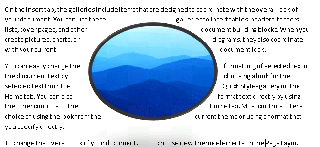

# L.4.11 WordprocessingML Drawing

=== "中文"

    在 WordprocessingML 文档中，可以包含图形 DrawingML 对象：

    - 图表 - Charts
    - 示意图 - Diagrams
    - 锁定的Canvases - Locked Canvases
    - 图片 - Pictures
  
    当这些对象出现在文字处理文档中时，有必要包括指定这些对象相对于分页文档如何定位的信息。

    WordprocessingML Drawing 命名空间发挥此功能，指定在字处理文档中锚定和显示 DrawingML 对象所需的所有信息。

    考虑一张 DrawingML 图片，该图片将显示在其出现的打印页面的中心，并根据需要修改文本流。 该对象将指定如下：

    ```xml
    <w:r>
        <w:drawing>
            <wp:anchor relativeHeight="10" allowOverlap="true">
                <wp:positionH relativeFrom="margin">
                    <wp:align>center</wp:align>
                </wp:positionH>
                <wp:positionV relativeFrom="margin">
                    <wp:align>center</wp:align>
                </wp:positionV>
                <wp:extent cx="2441542" cy="1828800"/>
                <wp:wrapSquare wrapText="bothSides"/>
                <a:graphic>
                …
                </a:graphic>
            </wp:anchor>
        </w:drawing>
    </w:r>
    ```

    锚元素指定该对象不与文本对齐，其子元素指定该对象在页面上水平和垂直居中，并且文本可以在其周围环绕成正方形。

=== "英文"

    **WordprocessingML Drawing**

    Within a WordprocessingML document, it is possible to include graphical DrawingML objects:

    - Charts
    - Diagrams
    - Locked Canvases
    - Pictures
  
    When these objects are present in a word processing document, it is necessary to include information that specifies how the objects are to be positioned relative to the paginated document.

    The WordprocessingML Drawing namespace acts in this capacity, specifying all information necessary to     anchor and display DrawingML objects within a word processing document.

    Consider a DrawingML picture that is to displayed in the center of the printed page on which it appears, modifying the flow of text as necessary. This object would be specified as follows:

    ```xml
    <w:r>
        <w:drawing>
            <wp:anchor relativeHeight="10" allowOverlap="true">
                <wp:positionH relativeFrom="margin">
                    <wp:align>center</wp:align>
                </wp:positionH>
                <wp:positionV relativeFrom="margin">
                    <wp:align>center</wp:align>
                </wp:positionV>
                <wp:extent cx="2441542" cy="1828800"/>
                <wp:wrapSquare wrapText="bothSides"/>
                <a:graphic>
                …
                </a:graphic>
            </wp:anchor>
        </w:drawing>
    </w:r>
    ```

    The anchor element specifies that this object is not positioned in-line with text, and its child elements specify that the object is centered on the page horizontally and vertically, and that text can wrap around it in a square.

## L.4.11.1 Object Anchoring

=== "中文"

    当WordprocessingML绘图命名空间用于在文档中锚定一个DrawingML对象时，该对象可以通过以下两种方式之一进行锚定：
    
    - 与文本同行 - 对象在常规文本流中显示（修改行高等以适应它）。
    - 浮动 - 对象在文档中绝对或相对定位，并且根据需要修改文本流以围绕它。

=== "英文"

    When the WordprocessingML Drawing namespace is used to anchor a DrawingML object within a document, that object can be anchored in one of two ways:
    
    - In line with text - The object is displayed within the regular text stream (modifying line height and so on to accommodate it).
    - Floating – The object is positioned absolutely or relatively within the document and text flow is modified as needed around it.

## L.4.11.2 Text Wrapping

=== "中文"

    除了定位数据外，WordprocessingML绘图还需要指定文本如何围绕对象流动。WordprocessingML文档中可以应用于浮动对象的文本环绕有五种不同的类型：
    
    - 文本前后 - 在这种文本环绕类型中，绘图对象被定位在文档上，文本不会在其周围移动。
    
        
    
    - 正方形环绕 - 在这种文本环绕类型中，绘图对象被定位在文档上，并且文件格式中存储了一个矩形来确定环绕的范围。
    
        
    
    - 紧密环绕 - 在这种文本环绕类型中，创建并存储了一个环绕多边形在WordprocessingML文档中，这个多边形决定了文本如何围绕绘图对象的左右两侧。
    
        - 通过环绕 - 在这种文本环绕类型中，就像紧密环绕一样创建了一个环绕多边形，但这种情况下，环绕多边形中的任何缩进都可以用文本填充。
    
        如果环绕多边形看起来像这样：
    
        
        
        紧密环绕看起来像这样：
        
         
    
        而通过环绕看起来像这样：
        
        
        
    
        在后一种情况下，注意文本填充了环绕多边形内的“缩进”。
    
    - 上下环绕 - 在这种文本环绕类型中，文本不能围绕对象的任一侧流动，只能从文档的底部边缘重新开始。
    
        

=== "英文"

    Aside from positioning data, WordprocessingML Drawing also needs to specify how text flows around the object. There are five different types of text wrapping which can be applied to floating objects present in WordprocessingML documents:

    - In Front/Behind Text - In this type of text wrapping, the drawing object is positioned on the document and text is not displaced around it.

        

    - Square Wrapping - In this type of text wrapping, the drawing object is positioned on the document and a rectangle is stored within the file format to determine the wrapping extents.

        

    - Tight Wrapping - In this type of text wrapping, a wrapping polygon is created and stored in the WordprocessingML document, and this polygon determines how text wraps around the left and right sides of the drawing object.

        

    - Through Wrapping - In this type of text wrapping, a wrapping polygon is created just like with tight wrapping, but any indents in the wrap polygon can be filled with text in this case.

        If the wrapping polygon looks like the following:

        
        
        Tight wrapping would look like this:
        
         

        While through wrapping would look like this:
        
        
        

        In the latter case, notice that text fills in the 'indentation' within the wrapping polygon.

    - Top and Bottom Wrapping - In this type of text wrapping, text cannot wrap around either side of the object, and must only restart below the bottom edge of the document.
            
        